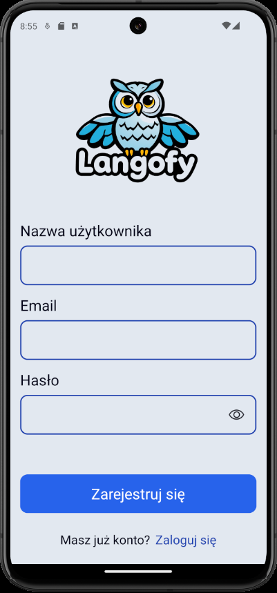
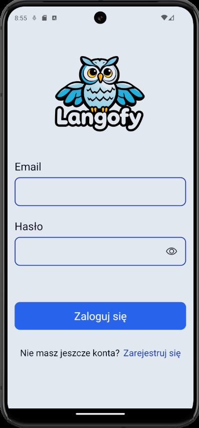
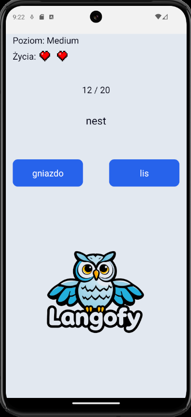
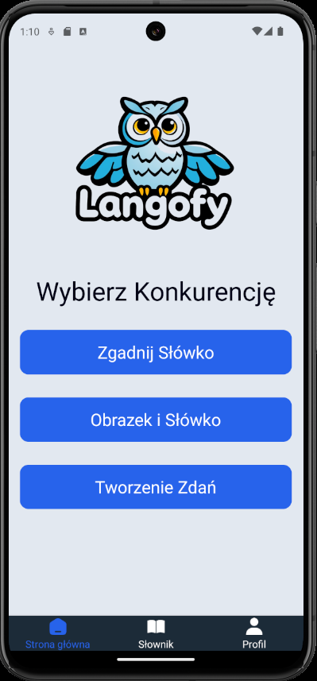
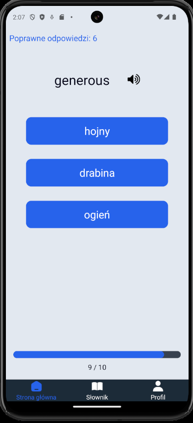
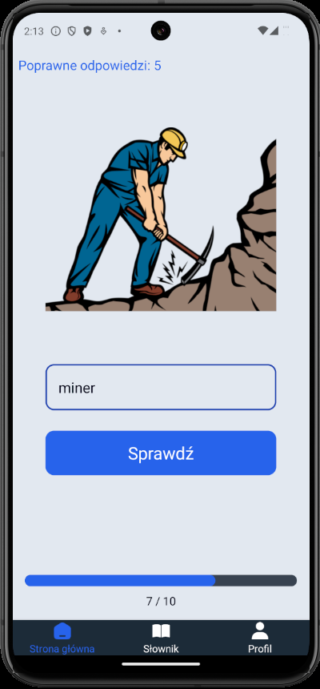
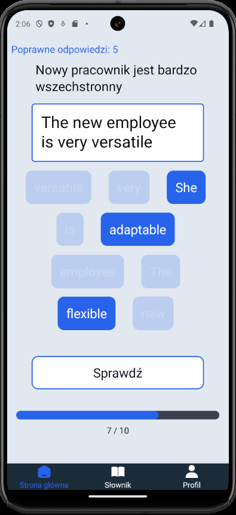
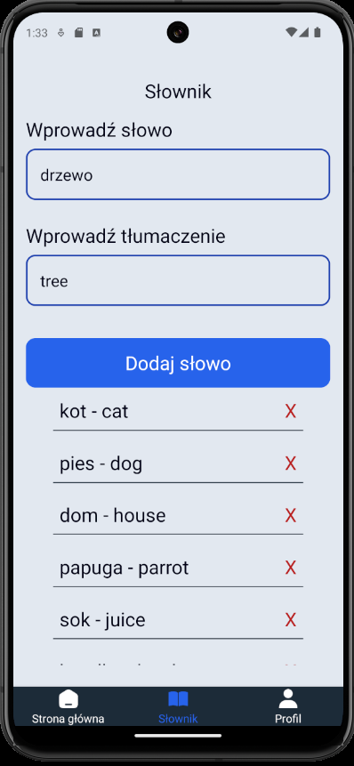
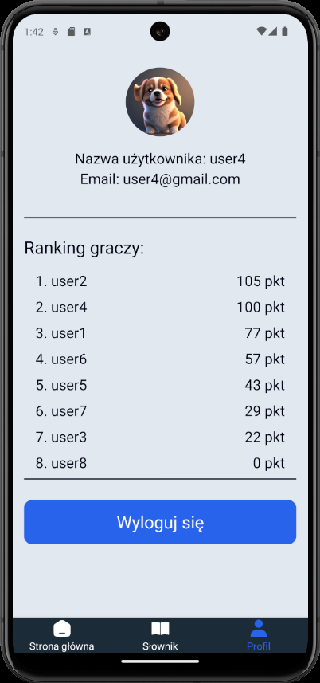

# Mobile English Learning App for Children

This app was created as part of my engineering thesis using React Native, providing a fun and interactive way for children to learn English through educational games.

## Features

### 1. User Login and Registration
The app allows users to register and log in to their account. Authentication and storing user data, including vocabulary, are managed using **Firebase**.

### 2. Personalized Difficulty Level
Upon the first login, users take a test to determine their appropriate level of difficulty. The test helps tailor the app to the child’s proficiency, ensuring an effective learning experience.

### 3. Educational Games
The app offers three interactive games to aid in learning English:

- **Game 1: Matching English Words to Polish Words**  
  The user must match English words to their Polish equivalents. Additionally, users can listen to the correct pronunciation of the English word to help improve their listening and pronunciation skills.
  
- **Game 2: Matching English Words to Images**  
  The child matches English words to the appropriate images, reinforcing vocabulary comprehension and memorization.

- **Game 3: Constructing Sentences from Random Words**  
  The user arranges randomly selected words into a grammatically correct sentence, helping to develop sentence-building skills.

### 4. Custom Vocabulary
Users have the ability to add their own words to their vocabulary list. This feature allows children to expand their learning by including words that are relevant to their interests, making the learning experience more personalized and engaging.  

### 5. User Profile and Ranking
The app provides access to the user’s profile, where they can view their information, log out, and track their progress. The profile also displays a player ranking, showing the scores of other users based on points earned in the games.

## Technologies Used
- **React Native** – for building the mobile application.
- **Firebase** – for managing the user database, vocabulary, and authentication.

## Screenshots

